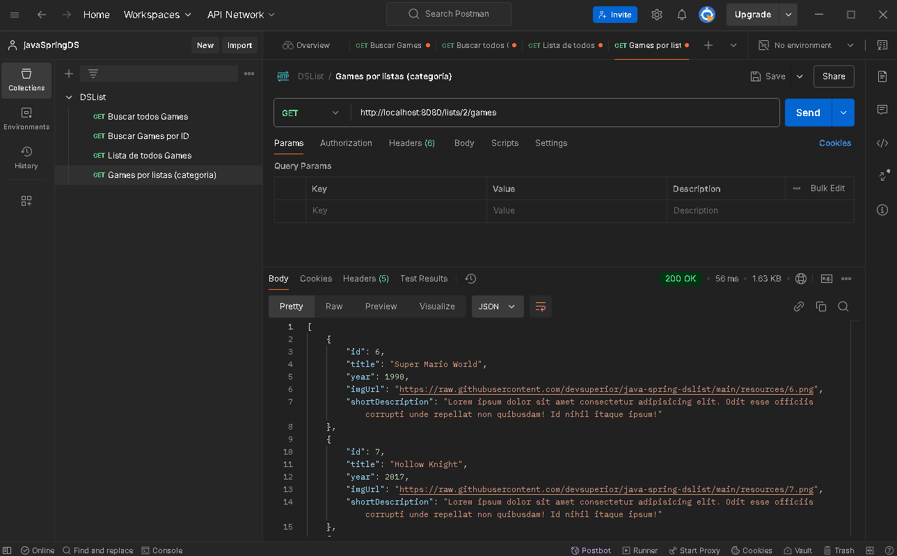

# listGames API

### 📋 Sobre o Projeto

O **listGames** é uma API desenvolvida para gerenciar um catálogo de jogos. Utilizando o framework **Spring**, a API segue as boas práticas do padrão **REST**, oferecendo recursos organizados e eficientes. Este projeto aborda conceitos fundamentais de desenvolvimento de sistemas web, implementação de APIs e processos de deploy.

---

### 🛠️ Conceitos e Tecnologias Utilizados

#### 🌐 **Sistemas Web e Recursos**
- **Cliente/Servidor**: Arquitetura de comunicação utilizando HTTP e formato JSON para troca de dados.
- **Padrão REST**: Organização dos endpoints e recursos da API seguindo convenções RESTful.

#### 📚 **Estruturação do Projeto**
- **Spring Rest**: Framework usado para criar e gerenciar a API.
- **Entidades e ORM**: Mapeamento objeto-relacional com o **JPA (Java Persistence API)**.
- **Database Seeding**: Inicialização do banco de dados com dados básicos para teste e validação.
- **Bancos de Dados**: H2 para testes em memória e migração PostgreSQL para produção.
- **Padrão de Camadas**: Organização do código em camadas como *Controller*, *Service* e *Repository*.
- **DTO (Data Transfer Object)**: Uso de objetos especializados para transferir dados entre camadas.

#### 🔗 **Relacionamentos e Consultas**
- **Relacionamentos N-N**: Implementação de associações entre entidades.
- **Classe de Associação e Embedded ID**: Estrutura para mapear tabelas intermediárias.
- **Consultas SQL no Spring Data JPA**: Criação de consultas personalizadas para acesso aos dados.
- **Projections**: Técnicas para otimizar consultas e retorno de dados específicos.

---

### 🚀 Processo de Deploy e Homologação

#### 🔧 **Homologação Local**
- Execução e testes da aplicação em ambiente local, garantindo a consistência do código e a funcionalidade dos recursos.

---

### 📂📤 Testes de Requisição (Postman)

---

### 🌟 Funcionalidades
- Buscar todos os Games
- Buscar Games por ID
- Buscar Categorias
- Buscar Games por Categorias
- Alterar posição dos Games do Banco de Dados

---

### 🤝 Contribuições
Sinta-se à vontade para contribuir com melhorias e novas funcionalidades. Para isso:
1. Faça um *fork* deste repositório.
2. Crie uma *branch* para sua funcionalidade (`git checkout -b feature/nova-funcionalidade`).
3. Envie um *pull request* para análise.

---

### 📑 Pré-requisitos
- **Java 17+**
- **Maven 3.8+**
- **Banco de Dados H2, PostgreSQL (ou outro suportado pelo JPA)**

---

### 📖 Referências
- Documentação oficial do [Spring Framework](https://spring.io/)
- Boas práticas de desenvolvimento em APIs RESTful.
